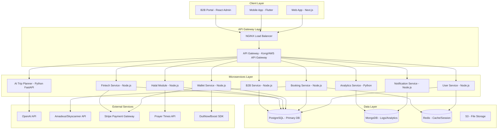
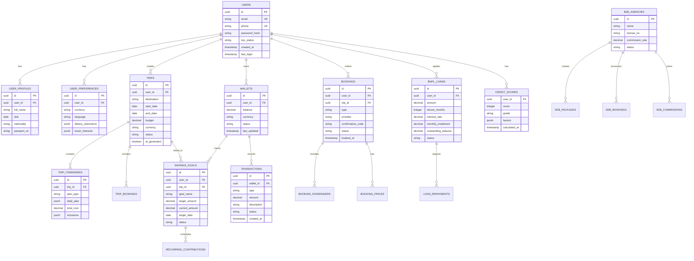

# Holiday AI - Full-Stack System Architecture
## Technical Specification Document v1.0

**Owner:** Viral Vision Sdn. Bhd.
**Platform:** AI-Powered Travel Super-App
**Target Launch:** Q2 2025

---

## Table of Contents

1. [Executive Summary](#executive-summary)
2. [System Architecture Overview](#system-architecture-overview)
3. [Technology Stack](#technology-stack)
4. [Microservices Architecture](#microservices-architecture)
5. [Database Design & ERD](#database-design--erd)
6. [API Specifications](#api-specifications)
7. [AI/ML Implementation](#aiml-implementation)
8. [Fintech Integration](#fintech-integration)
9. [Security Architecture](#security-architecture)
10. [Scalability & Performance](#scalability--performance)
11. [DevOps & Deployment](#devops--deployment)
12. [3-Month MVP Roadmap](#3-month-mvp-roadmap)
13. [Maintenance & Monitoring](#maintenance--monitoring)

---

## Executive Summary

Holiday AI is a first-of-its-kind AI-powered travel operating system that unifies **trip planning**, **booking**, **fintech** (wallet, BNPL, loans), and **halal/Umrah** modules into a single platform. This document outlines the complete technical architecture for building a production-ready, scalable system targeting 50,000+ users within 18 months.

### Core Value Proposition
- **AI-First**: NLP-based itinerary generation with personalization
- **Fintech-Enabled**: Goal-based savings + BNPL + holiday loans
- **Culturally Inclusive**: Halal dining, prayer times, Umrah planning
- **B2B SaaS**: White-label platform for travel agencies

---

## System Architecture Overview

### High-Level Architecture Diagram



### Architecture Principles

1. **Microservices-First**: Independently deployable services
2. **Event-Driven**: Asynchronous communication via message queues
3. **API-First Design**: RESTful + GraphQL hybrid
4. **Cloud-Native**: AWS infrastructure with auto-scaling
5. **Security by Design**: Zero-trust architecture, end-to-end encryption

---

## Technology Stack

### Backend Services

#### Core Services (Node.js/TypeScript)
```json
{
  "runtime": "Node.js 20 LTS",
  "framework": "NestJS (modular microservices)",
  "language": "TypeScript 5.0+",
  "api-style": "REST + GraphQL hybrid",
  "validation": "class-validator, Joi",
  "testing": "Jest, Supertest"
}
```

#### AI/ML Services (Python)
```json
{
  "runtime": "Python 3.11",
  "framework": "FastAPI",
  "ml-libraries": "TensorFlow, scikit-learn, pandas",
  "nlp": "OpenAI API, LangChain",
  "vector-db": "Pinecone (for RAG)"
}
```

### Frontend

#### Web Application
```json
{
  "framework": "Next.js 14 (App Router)",
  "language": "TypeScript",
  "styling": "Tailwind CSS, shadcn/ui",
  "state-management": "Zustand, React Query",
  "auth": "NextAuth.js"
}
```

#### Mobile Application
```json
{
  "framework": "Flutter 3.16+",
  "language": "Dart",
  "state-management": "Riverpod",
  "local-storage": "Hive",
  "push-notifications": "Firebase Cloud Messaging"
}
```

### Database & Storage

| Purpose | Technology | Use Case |
|---------|-----------|----------|
| **Primary Database** | PostgreSQL 15 | Users, trips, bookings, transactions |
| **Cache Layer** | Redis 7.x | Session storage, price cache, rate limiting |
| **Document Store** | MongoDB 6.0 | Analytics logs, activity tracking |
| **File Storage** | AWS S3 | User uploads, documents, images |
| **Vector Database** | Pinecone | AI embeddings for trip recommendations |

### Infrastructure & DevOps

```yaml
cloud_provider: AWS
compute:
  - EC2 (t3.medium for services)
  - Lambda (serverless AI tasks)
  - ECS/Fargate (container orchestration)
database:
  - RDS PostgreSQL (Multi-AZ)
  - ElastiCache Redis
  - DocumentDB (MongoDB-compatible)
networking:
  - VPC with private subnets
  - CloudFront CDN
  - Route 53 DNS
monitoring:
  - CloudWatch
  - Datadog APM
  - Sentry (error tracking)
ci_cd:
  - GitHub Actions
  - Docker
  - Terraform (IaC)
```

---

## Microservices Architecture

### 1. User Service
**Responsibility**: Authentication, user profiles, preferences management

```typescript
// Tech Stack
- Framework: NestJS
- Database: PostgreSQL (users, profiles, preferences)
- Cache: Redis (sessions)
- Auth: Firebase Auth + JWT

// Key Endpoints
POST   /api/v1/auth/register
POST   /api/v1/auth/login
GET    /api/v1/users/:userId/profile
PATCH  /api/v1/users/:userId/preferences
POST   /api/v1/auth/verify-otp
```

**Database Tables**:
- `users` (id, email, phone, password_hash, kyc_status, created_at)
- `user_profiles` (user_id, full_name, dob, nationality, passport_no)
- `user_preferences` (user_id, currency, language, dietary_restrictions)

---

### 2. AI Trip Planner Service
**Responsibility**: Generate personalized itineraries using AI

```python
# Tech Stack
- Framework: FastAPI
- AI: OpenAI GPT-4 + RAG with Pinecone
- ML: TensorFlow (price prediction model)

# Key Endpoints
POST   /api/v1/trips/generate
GET    /api/v1/trips/:tripId
PATCH  /api/v1/trips/:tripId/customize
POST   /api/v1/trips/:tripId/optimize
GET    /api/v1/trips/recommendations
```

**AI Workflow**:
```python
def generate_trip_itinerary(user_input: TripRequest) -> TripPlan:
    """
    AI Trip Generation Pipeline
    """
    # Step 1: Extract user intent
    intent = extract_travel_intent(user_input.description)

    # Step 2: Query travel knowledge base (RAG)
    context = query_vector_db(
        destination=user_input.destination,
        budget=user_input.budget,
        dates=user_input.dates
    )

    # Step 3: Generate itinerary with OpenAI
    prompt = f"""
    Generate a {user_input.travel_style} trip to {user_input.destination}
    Budget: {user_input.budget} {user_input.currency}
    Duration: {user_input.duration} days
    Preferences: {user_input.preferences}

    Context: {context}

    Return 3 options: Budget, Comfort, Luxury
    Format: JSON with daily activities, costs, accommodations
    """

    response = openai.ChatCompletion.create(
        model="gpt-4-turbo",
        messages=[{"role": "system", "content": prompt}],
        response_format={"type": "json_object"}
    )

    # Step 4: Enrich with real-time pricing
    itinerary = json.loads(response.choices[0].message.content)
    enriched = enrich_with_pricing(itinerary)

    # Step 5: Predict price trends
    price_forecast = predict_price_trends(enriched)

    return TripPlan(**enriched, price_forecast=price_forecast)
```

**Database Tables**:
- `trips` (id, user_id, destination, budget, status, ai_generated)
- `trip_itineraries` (id, trip_id, plan_type, daily_plan, total_cost)
- `trip_bookings` (id, trip_id, booking_ids, booked_at)

---

### 3. Booking Service
**Responsibility**: Aggregate and book flights, hotels, activities

```typescript
// Tech Stack
- Framework: NestJS
- External APIs: Amadeus, Skyscanner, Booking.com
- Cache: Redis (rate limiting, price cache)

// Key Endpoints
GET    /api/v1/bookings/flights/search
GET    /api/v1/bookings/hotels/search
GET    /api/v1/bookings/activities/search
POST   /api/v1/bookings/flights/book
POST   /api/v1/bookings/hotels/book
GET    /api/v1/bookings/:bookingId/status
POST   /api/v1/bookings/:bookingId/cancel
```

**Booking Workflow**:
```typescript
class BookingOrchestrator {
  async bookCompleteTrip(tripId: string, userId: string): Promise<BookingResult> {
    // Step 1: Validate wallet balance or BNPL eligibility
    const paymentMethod = await this.validatePayment(userId, tripId);

    // Step 2: Book flights
    const flightBooking = await this.amadeus.bookFlight(trip.flights);

    // Step 3: Book hotel
    const hotelBooking = await this.bookingCom.reserveHotel(trip.hotels);

    // Step 4: Book activities
    const activityBookings = await this.viator.bookActivities(trip.activities);

    // Step 5: Create transaction record
    const transaction = await this.walletService.deductFunds(
      userId,
      trip.totalCost,
      paymentMethod
    );

    // Step 6: Emit booking confirmation event
    await this.eventBus.publish('booking.confirmed', {
      userId,
      tripId,
      bookings: [flightBooking, hotelBooking, ...activityBookings]
    });

    return {
      bookingId: uuid(),
      status: 'confirmed',
      confirmationCodes: {
        flight: flightBooking.pnr,
        hotel: hotelBooking.confirmationNo,
        activities: activityBookings.map(b => b.confirmationNo)
      }
    };
  }
}
```

**Database Tables**:
- `bookings` (id, user_id, trip_id, type, provider, confirmation_code)
- `booking_prices` (booking_id, base_price, fees, total, currency)
- `booking_passengers` (booking_id, passenger_name, passport_no)

---

### 4. Wallet Service
**Responsibility**: Digital wallet, savings goals, transactions

```typescript
// Tech Stack
- Framework: NestJS
- Database: PostgreSQL (ACID transactions)
- Cache: Redis (balance cache)

// Key Endpoints
GET    /api/v1/wallet/:userId/balance
POST   /api/v1/wallet/:userId/topup
POST   /api/v1/wallet/:userId/withdraw
GET    /api/v1/wallet/:userId/transactions
POST   /api/v1/wallet/:userId/savings/create
GET    /api/v1/wallet/:userId/savings/:goalId
PATCH  /api/v1/wallet/:userId/savings/:goalId/contribute
```

**Savings Goal Algorithm**:
```typescript
interface SavingsGoal {
  id: string;
  userId: string;
  targetAmount: number;
  targetDate: Date;
  currentAmount: number;
  recurringContribution: number;
  frequency: 'daily' | 'weekly' | 'monthly';
  linkedTripId?: string;
}

class SavingsEngine {
  calculateRecommendedContribution(goal: SavingsGoal): RecommendationResult {
    const today = new Date();
    const daysRemaining = differenceInDays(goal.targetDate, today);
    const amountRemaining = goal.targetAmount - goal.currentAmount;

    // Calculate optimal contribution
    const dailyRequired = amountRemaining / daysRemaining;
    const monthlyRequired = dailyRequired * 30;

    // Factor in user's average spending
    const userAvgSpending = await this.getAverageMonthlySpending(goal.userId);
    const affordableContribution = userAvgSpending * 0.15; // 15% rule

    const recommended = Math.min(monthlyRequired, affordableContribution);

    // Predict achievement probability
    const probability = this.predictGoalAchievement(
      goal.currentAmount,
      recommended,
      goal.targetAmount,
      daysRemaining
    );

    return {
      recommendedAmount: recommended,
      achievementProbability: probability,
      projectedCompletionDate: addDays(today, amountRemaining / (recommended / 30)),
      alternativeScenarios: [
        { contribution: recommended * 1.2, completionDate: '...' },
        { contribution: recommended * 0.8, completionDate: '...' }
      ]
    };
  }
}
```

**Database Tables**:
- `wallets` (id, user_id, balance, currency, status, last_updated)
- `transactions` (id, wallet_id, type, amount, description, created_at)
- `savings_goals` (id, user_id, target_amount, current_amount, target_date)
- `recurring_contributions` (id, goal_id, amount, frequency, next_deduction)

---

### 5. Fintech Service
**Responsibility**: BNPL, holiday loans, credit scoring

```typescript
// Tech Stack
- Framework: NestJS
- Partners: Stripe, Affin Islamic Bank, AEON Credit
- Compliance: PCI-DSS, BNM regulations

// Key Endpoints
POST   /api/v1/fintech/bnpl/check-eligibility
POST   /api/v1/fintech/bnpl/apply
GET    /api/v1/fintech/bnpl/:applicationId/status
POST   /api/v1/fintech/loans/apply
GET    /api/v1/fintech/loans/:loanId/schedule
POST   /api/v1/fintech/loans/:loanId/repay
GET    /api/v1/fintech/credit-score/:userId
```

**Credit Scoring Algorithm**:
```typescript
interface CreditScoreFactors {
  accountAge: number; // Days since account creation
  bookingHistory: number; // Number of completed bookings
  paymentHistory: number; // On-time payment rate (0-1)
  averageBookingValue: number;
  cancellationRate: number;
  walletActivity: number; // Monthly transaction count
  savingsGoalCompletion: number; // Goals achieved rate
}

class CreditScoringEngine {
  calculateScore(userId: string): Promise<CreditScore> {
    const factors = await this.getUserCreditFactors(userId);

    // Weighted scoring model
    const weights = {
      accountAge: 0.15,
      bookingHistory: 0.20,
      paymentHistory: 0.30,
      averageBookingValue: 0.10,
      cancellationRate: -0.15,
      walletActivity: 0.10,
      savingsGoalCompletion: 0.10
    };

    let rawScore = 0;
    rawScore += this.normalizeAccountAge(factors.accountAge) * weights.accountAge;
    rawScore += Math.min(factors.bookingHistory / 10, 1) * weights.bookingHistory;
    rawScore += factors.paymentHistory * weights.paymentHistory;
    rawScore += this.normalizeBookingValue(factors.averageBookingValue) * weights.averageBookingValue;
    rawScore += factors.cancellationRate * weights.cancellationRate;
    rawScore += Math.min(factors.walletActivity / 20, 1) * weights.walletActivity;
    rawScore += factors.savingsGoalCompletion * weights.savingsGoalCompletion;

    // Scale to 300-850 range (FICO-like)
    const score = Math.round(300 + (rawScore * 550));

    return {
      score: score,
      grade: this.getScoreGrade(score),
      bnplLimit: this.calculateBNPLLimit(score, factors),
      loanEligibility: score >= 600,
      maxLoanAmount: this.calculateMaxLoan(score, factors)
    };
  }

  calculateBNPLLimit(score: number, factors: CreditScoreFactors): number {
    // Base limit on score
    let limit = 0;
    if (score >= 700) limit = 5000;
    else if (score >= 650) limit = 3000;
    else if (score >= 600) limit = 1500;
    else if (score >= 550) limit = 800;
    else return 0;

    // Adjust based on booking history
    if (factors.bookingHistory > 5) limit *= 1.2;
    if (factors.paymentHistory > 0.95) limit *= 1.15;

    return Math.round(limit);
  }
}
```

**BNPL Workflow**:
```typescript
async processBNPLApplication(application: BNPLApplication): Promise<BNPLApproval> {
  // Step 1: Credit check
  const creditScore = await this.creditEngine.calculateScore(application.userId);

  if (creditScore.score < 550) {
    return { approved: false, reason: 'Insufficient credit score' };
  }

  // Step 2: Affordability check
  const monthlyIncome = await this.estimateMonthlyIncome(application.userId);
  const existingObligations = await this.getExistingLoans(application.userId);
  const affordability = monthlyIncome - existingObligations;

  const monthlyInstalment = application.amount / application.tenure;

  if (monthlyInstalment > affordability * 0.30) {
    return { approved: false, reason: 'Instalment exceeds 30% of disposable income' };
  }

  // Step 3: Partner API call (e.g., Affin Islamic BNPL)
  const partnerApproval = await this.affinBank.submitBNPLApplication({
    userId: application.userId,
    amount: application.amount,
    tenure: application.tenure,
    creditScore: creditScore.score
  });

  if (!partnerApproval.approved) {
    return { approved: false, reason: partnerApproval.reason };
  }

  // Step 4: Create BNPL record
  const bnpl = await this.bnplRepository.create({
    userId: application.userId,
    amount: application.amount,
    tenure: application.tenure,
    interestRate: this.calculateInterestRate(creditScore.score),
    monthlyInstalment: monthlyInstalment,
    status: 'active',
    partnerId: partnerApproval.partnerId,
    externalLoanId: partnerApproval.loanId
  });

  return {
    approved: true,
    bnplId: bnpl.id,
    terms: {
      amount: application.amount,
      tenure: application.tenure,
      monthlyInstalment: monthlyInstalment,
      totalRepayable: monthlyInstalment * application.tenure,
      interestRate: bnpl.interestRate
    }
  };
}
```

**Database Tables**:
- `bnpl_applications` (id, user_id, amount, tenure, status, credit_score)
- `bnpl_loans` (id, user_id, amount, monthly_instalment, outstanding, status)
- `loan_repayments` (id, loan_id, amount, due_date, paid_date, status)
- `credit_scores` (user_id, score, grade, calculated_at, factors_json)

---

### 6. Halal Module Service
**Responsibility**: Prayer times, halal dining, Muslim-friendly hotels, Umrah planning

```typescript
// Tech Stack
- Framework: NestJS
- APIs: Aladhan (prayer times), HalalTrip API
- Database: PostgreSQL (halal places directory)

// Key Endpoints
GET    /api/v1/halal/prayer-times
GET    /api/v1/halal/restaurants
GET    /api/v1/halal/hotels
GET    /api/v1/halal/mosques
POST   /api/v1/halal/umrah/plan
GET    /api/v1/halal/qibla-direction
```

**Umrah Planning Engine**:
```typescript
interface UmrahPlan {
  departureCity: string;
  packageType: 'economy' | 'standard' | 'premium';
  duration: number; // days
  groupSize: number;
  includesMedina: boolean;
}

class UmrahPlanningService {
  async generateUmrahPackage(plan: UmrahPlan): Promise<UmrahItinerary> {
    // Step 1: Flight options to Jeddah
    const flights = await this.bookingService.searchFlights({
      from: plan.departureCity,
      to: 'JED', // Jeddah
      dates: plan.dates
    });

    // Step 2: Hotel selection near Haram
    const hotels = await this.getHaramHotels(plan.packageType);

    // Step 3: Generate daily itinerary
    const itinerary = [
      { day: 1, activities: ['Arrival', 'Check-in', 'Rest', 'Isha at Haram'] },
      { day: 2, activities: ['Fajr at Haram', 'Umrah rituals', 'Tawaf', 'Sa\'i', 'Halq/Taqsir'] },
      { day: 3, activities: ['Visit to Masjid Aisha', 'Shopping', 'Duas at Multazam'] },
      // ... more days
    ];

    if (plan.includesMedina) {
      itinerary.push(
        { day: 4, activities: ['Travel to Medina', 'Visit Masjid Nabawi'] },
        { day: 5, activities: ['Quba Mosque', 'Qiblatain', 'Uhud'] }
      );
    }

    // Step 4: Calculate total cost
    const totalCost = this.calculateUmrahCost({
      flights,
      hotel: hotels[0],
      duration: plan.duration,
      groupSize: plan.groupSize
    });

    return {
      itinerary,
      flights,
      hotel: hotels[0],
      totalCost,
      inclusions: ['Flights', 'Hotel', 'Ground transport', 'Visa assistance'],
      religiousGuidance: await this.getUmrahGuide()
    };
  }
}
```

**Database Tables**:
- `halal_restaurants` (id, name, location, cuisine, certification, rating)
- `halal_hotels` (id, name, location, prayer_facilities, halal_food, rating)
- `mosques` (id, name, location, coordinates, services)
- `umrah_packages` (id, provider, package_type, cost, inclusions)

---

### 7. B2B Portal Service
**Responsibility**: White-label SaaS for travel agencies

```typescript
// Tech Stack
- Framework: NestJS
- Frontend: React Admin Dashboard
- Multi-tenancy: Separate schemas per agency

// Key Endpoints
POST   /api/v1/b2b/agencies/register
GET    /api/v1/b2b/agencies/:agencyId/dashboard
POST   /api/v1/b2b/packages/create
GET    /api/v1/b2b/packages/:packageId
POST   /api/v1/b2b/bookings/create
GET    /api/v1/b2b/commissions/report
GET    /api/v1/b2b/analytics
```

**Agency Commission Model**:
```typescript
interface CommissionRule {
  agencyId: string;
  bookingType: 'flight' | 'hotel' | 'package';
  commissionRate: number; // percentage
  minimumBookingValue: number;
}

class CommissionEngine {
  calculateCommission(booking: Booking, agency: Agency): Commission {
    const rules = await this.getCommissionRules(agency.id);
    const applicableRule = rules.find(r => r.bookingType === booking.type);

    if (!applicableRule || booking.totalValue < applicableRule.minimumBookingValue) {
      return { amount: 0, rate: 0 };
    }

    const commissionAmount = booking.totalValue * (applicableRule.commissionRate / 100);

    // Create commission record
    await this.commissionRepository.create({
      agencyId: agency.id,
      bookingId: booking.id,
      amount: commissionAmount,
      rate: applicableRule.commissionRate,
      status: 'pending', // paid after booking completion
      dueDate: addDays(booking.completionDate, 30)
    });

    return {
      amount: commissionAmount,
      rate: applicableRule.commissionRate,
      payoutDate: addDays(booking.completionDate, 30)
    };
  }
}
```

**Database Tables**:
- `b2b_agencies` (id, name, license_no, commission_rate, status)
- `b2b_packages` (id, agency_id, package_name, destinations, cost, markup)
- `b2b_bookings` (id, agency_id, customer_id, package_id, status)
- `b2b_commissions` (id, agency_id, booking_id, amount, paid_date)

---

### 8. Notification Service
**Responsibility**: Push notifications, emails, SMS

```typescript
// Tech Stack
- Framework: NestJS
- Email: SendGrid
- SMS: Twilio
- Push: Firebase Cloud Messaging

// Key Endpoints
POST   /api/v1/notifications/send
GET    /api/v1/notifications/:userId/history
PATCH  /api/v1/notifications/:userId/preferences
```

**Event-Driven Notifications**:
```typescript
class NotificationEventHandler {
  @EventPattern('booking.confirmed')
  async handleBookingConfirmation(event: BookingConfirmedEvent) {
    const user = await this.userService.findById(event.userId);

    // Send email
    await this.emailService.send({
      to: user.email,
      template: 'booking-confirmation',
      data: {
        userName: user.name,
        bookingId: event.bookingId,
        tripDetails: event.trip
      }
    });

    // Send push notification
    await this.fcmService.send({
      token: user.fcmToken,
      title: 'Booking Confirmed! 🎉',
      body: `Your trip to ${event.trip.destination} is confirmed!`,
      data: { bookingId: event.bookingId }
    });

    // Send SMS
    if (user.preferences.smsNotifications) {
      await this.twilioService.send({
        to: user.phone,
        message: `Holiday AI: Your booking ${event.bookingId} is confirmed!`
      });
    }
  }

  @EventPattern('price.drop')
  async handlePriceDrop(event: PriceDropEvent) {
    // Notify users watching this trip
    const interestedUsers = await this.tripService.getWatchers(event.tripId);

    for (const user of interestedUsers) {
      await this.pushService.send({
        userId: user.id,
        title: 'Price Drop Alert! 💰',
        body: `${event.destination} trip now ${event.newPrice} (was ${event.oldPrice})`,
        action: 'VIEW_TRIP',
        data: { tripId: event.tripId }
      });
    }
  }
}
```

**Database Tables**:
- `notifications` (id, user_id, type, title, body, read, created_at)
- `notification_preferences` (user_id, email, push, sms, categories)

---

### 9. Analytics Service
**Responsibility**: User behavior tracking, ML model training

```python
# Tech Stack
- Framework: FastAPI
- Analytics: Pandas, NumPy
- ML: TensorFlow, scikit-learn
- Visualization: Plotly

# Key Endpoints
POST   /api/v1/analytics/events/track
GET    /api/v1/analytics/users/:userId/insights
GET    /api/v1/analytics/dashboard/metrics
POST   /api/v1/analytics/ml/train-model
```

**ML Model: Price Prediction**:
```python
import tensorflow as tf
from tensorflow import keras
from sklearn.preprocessing import StandardScaler

class PricePredictionModel:
    def __init__(self):
        self.model = self.build_model()
        self.scaler = StandardScaler()

    def build_model(self):
        """
        Neural network for flight price prediction
        """
        model = keras.Sequential([
            keras.layers.Dense(128, activation='relu', input_shape=(15,)),
            keras.layers.Dropout(0.3),
            keras.layers.Dense(64, activation='relu'),
            keras.layers.Dropout(0.2),
            keras.layers.Dense(32, activation='relu'),
            keras.layers.Dense(1)  # Price output
        ])

        model.compile(
            optimizer='adam',
            loss='mse',
            metrics=['mae']
        )

        return model

    def prepare_features(self, flight_data):
        """
        Feature engineering for price prediction
        """
        features = []

        # Time-based features
        features.append(flight_data['days_until_departure'])
        features.append(flight_data['day_of_week'])
        features.append(flight_data['month'])
        features.append(flight_data['is_weekend'])
        features.append(flight_data['is_holiday_season'])

        # Route features
        features.append(flight_data['route_popularity_score'])
        features.append(flight_data['distance_km'])
        features.append(flight_data['num_stops'])

        # Airline features
        features.append(flight_data['airline_rating'])
        features.append(flight_data['airline_price_index'])

        # Historical features
        features.append(flight_data['avg_price_last_30d'])
        features.append(flight_data['price_volatility'])
        features.append(flight_data['booking_velocity'])

        # External features
        features.append(flight_data['fuel_price_index'])
        features.append(flight_data['demand_index'])

        return np.array(features).reshape(1, -1)

    def predict_price_trend(self, flight_data):
        """
        Predict future price trend
        """
        features = self.prepare_features(flight_data)
        scaled_features = self.scaler.transform(features)

        predicted_price = self.model.predict(scaled_features)[0][0]

        # Calculate confidence interval
        current_price = flight_data['current_price']
        price_diff = predicted_price - current_price
        trend = 'increase' if price_diff > 0 else 'decrease'

        return {
            'current_price': current_price,
            'predicted_price': predicted_price,
            'price_change': price_diff,
            'percentage_change': (price_diff / current_price) * 100,
            'trend': trend,
            'recommendation': 'book_now' if trend == 'increase' else 'wait',
            'confidence': self.calculate_confidence(flight_data)
        }
```

**Database Tables**:
- `analytics_events` (id, user_id, event_type, properties, timestamp)
- `user_segments` (user_id, segment, score, last_updated)
- `ml_models` (id, model_type, version, accuracy, trained_at)

---

## Database Design & ERD

### Complete Entity Relationship Diagram



### PostgreSQL Schema Script

```sql
-- Users and Authentication
CREATE TABLE users (
    id UUID PRIMARY KEY DEFAULT gen_random_uuid(),
    email VARCHAR(255) UNIQUE NOT NULL,
    phone VARCHAR(20) UNIQUE NOT NULL,
    password_hash VARCHAR(255) NOT NULL,
    kyc_status VARCHAR(20) DEFAULT 'pending',
    is_active BOOLEAN DEFAULT true,
    created_at TIMESTAMP DEFAULT NOW(),
    last_login TIMESTAMP,
    INDEX idx_email (email),
    INDEX idx_phone (phone)
);

CREATE TABLE user_profiles (
    id UUID PRIMARY KEY DEFAULT gen_random_uuid(),
    user_id UUID REFERENCES users(id) ON DELETE CASCADE,
    full_name VARCHAR(255) NOT NULL,
    dob DATE,
    nationality VARCHAR(3),
    passport_no VARCHAR(50),
    profile_picture_url TEXT,
    created_at TIMESTAMP DEFAULT NOW(),
    updated_at TIMESTAMP DEFAULT NOW()
);

CREATE TABLE user_preferences (
    id UUID PRIMARY KEY DEFAULT gen_random_uuid(),
    user_id UUID REFERENCES users(id) ON DELETE CASCADE,
    currency VARCHAR(3) DEFAULT 'MYR',
    language VARCHAR(5) DEFAULT 'en',
    dietary_restrictions JSONB,
    travel_interests JSONB,
    notification_settings JSONB,
    updated_at TIMESTAMP DEFAULT NOW()
);

-- Trips and Itineraries
CREATE TABLE trips (
    id UUID PRIMARY KEY DEFAULT gen_random_uuid(),
    user_id UUID REFERENCES users(id) ON DELETE CASCADE,
    destination VARCHAR(255) NOT NULL,
    start_date DATE NOT NULL,
    end_date DATE NOT NULL,
    budget DECIMAL(10, 2),
    currency VARCHAR(3) DEFAULT 'MYR',
    status VARCHAR(20) DEFAULT 'planning',
    ai_generated BOOLEAN DEFAULT false,
    travel_style VARCHAR(20),
    created_at TIMESTAMP DEFAULT NOW(),
    updated_at TIMESTAMP DEFAULT NOW(),
    INDEX idx_user_trips (user_id, created_at),
    INDEX idx_destination (destination)
);

CREATE TABLE trip_itineraries (
    id UUID PRIMARY KEY DEFAULT gen_random_uuid(),
    trip_id UUID REFERENCES trips(id) ON DELETE CASCADE,
    plan_type VARCHAR(20) NOT NULL, -- budget, comfort, luxury
    daily_plan JSONB NOT NULL,
    total_cost DECIMAL(10, 2),
    inclusions JSONB,
    ai_prompt TEXT,
    generated_at TIMESTAMP DEFAULT NOW()
);

-- Wallet and Transactions
CREATE TABLE wallets (
    id UUID PRIMARY KEY DEFAULT gen_random_uuid(),
    user_id UUID REFERENCES users(id) ON DELETE CASCADE,
    balance DECIMAL(12, 2) DEFAULT 0.00,
    currency VARCHAR(3) DEFAULT 'MYR',
    status VARCHAR(20) DEFAULT 'active',
    last_updated TIMESTAMP DEFAULT NOW(),
    UNIQUE(user_id, currency)
);

CREATE TABLE transactions (
    id UUID PRIMARY KEY DEFAULT gen_random_uuid(),
    wallet_id UUID REFERENCES wallets(id) ON DELETE CASCADE,
    type VARCHAR(20) NOT NULL, -- credit, debit
    amount DECIMAL(12, 2) NOT NULL,
    description TEXT,
    reference_id UUID,
    reference_type VARCHAR(50),
    status VARCHAR(20) DEFAULT 'completed',
    created_at TIMESTAMP DEFAULT NOW(),
    INDEX idx_wallet_transactions (wallet_id, created_at)
);

CREATE TABLE savings_goals (
    id UUID PRIMARY KEY DEFAULT gen_random_uuid(),
    user_id UUID REFERENCES users(id) ON DELETE CASCADE,
    trip_id UUID REFERENCES trips(id) ON DELETE SET NULL,
    goal_name VARCHAR(255) NOT NULL,
    target_amount DECIMAL(10, 2) NOT NULL,
    current_amount DECIMAL(10, 2) DEFAULT 0.00,
    target_date DATE NOT NULL,
    status VARCHAR(20) DEFAULT 'active',
    created_at TIMESTAMP DEFAULT NOW(),
    achieved_at TIMESTAMP,
    INDEX idx_user_goals (user_id, status)
);

CREATE TABLE recurring_contributions (
    id UUID PRIMARY KEY DEFAULT gen_random_uuid(),
    goal_id UUID REFERENCES savings_goals(id) ON DELETE CASCADE,
    amount DECIMAL(10, 2) NOT NULL,
    frequency VARCHAR(20) NOT NULL, -- daily, weekly, monthly
    next_deduction_date DATE NOT NULL,
    is_active BOOLEAN DEFAULT true,
    created_at TIMESTAMP DEFAULT NOW()
);

-- Bookings
CREATE TABLE bookings (
    id UUID PRIMARY KEY DEFAULT gen_random_uuid(),
    user_id UUID REFERENCES users(id) ON DELETE CASCADE,
    trip_id UUID REFERENCES trips(id) ON DELETE SET NULL,
    type VARCHAR(20) NOT NULL, -- flight, hotel, activity
    provider VARCHAR(100),
    confirmation_code VARCHAR(50),
    booking_details JSONB NOT NULL,
    status VARCHAR(20) DEFAULT 'confirmed',
    booked_at TIMESTAMP DEFAULT NOW(),
    INDEX idx_user_bookings (user_id, booked_at)
);

CREATE TABLE booking_prices (
    id UUID PRIMARY KEY DEFAULT gen_random_uuid(),
    booking_id UUID REFERENCES bookings(id) ON DELETE CASCADE,
    base_price DECIMAL(10, 2) NOT NULL,
    taxes_fees DECIMAL(10, 2) DEFAULT 0.00,
    total_price DECIMAL(10, 2) NOT NULL,
    currency VARCHAR(3) DEFAULT 'MYR',
    payment_method VARCHAR(50)
);

CREATE TABLE booking_passengers (
    id UUID PRIMARY KEY DEFAULT gen_random_uuid(),
    booking_id UUID REFERENCES bookings(id) ON DELETE CASCADE,
    passenger_name VARCHAR(255) NOT NULL,
    passport_no VARCHAR(50),
    dob DATE,
    nationality VARCHAR(3)
);

-- Fintech: BNPL and Loans
CREATE TABLE bnpl_applications (
    id UUID PRIMARY KEY DEFAULT gen_random_uuid(),
    user_id UUID REFERENCES users(id) ON DELETE CASCADE,
    amount DECIMAL(10, 2) NOT NULL,
    tenure_months INTEGER NOT NULL,
    status VARCHAR(20) DEFAULT 'pending',
    credit_score INTEGER,
    approval_reason TEXT,
    applied_at TIMESTAMP DEFAULT NOW(),
    processed_at TIMESTAMP
);

CREATE TABLE bnpl_loans (
    id UUID PRIMARY KEY DEFAULT gen_random_uuid(),
    user_id UUID REFERENCES users(id) ON DELETE CASCADE,
    application_id UUID REFERENCES bnpl_applications(id),
    amount DECIMAL(10, 2) NOT NULL,
    tenure_months INTEGER NOT NULL,
    interest_rate DECIMAL(5, 2),
    monthly_instalment DECIMAL(10, 2) NOT NULL,
    outstanding_balance DECIMAL(10, 2),
    status VARCHAR(20) DEFAULT 'active',
    partner_id VARCHAR(100),
    external_loan_id VARCHAR(100),
    disbursed_at TIMESTAMP DEFAULT NOW()
);

CREATE TABLE loan_repayments (
    id UUID PRIMARY KEY DEFAULT gen_random_uuid(),
    loan_id UUID REFERENCES bnpl_loans(id) ON DELETE CASCADE,
    instalment_number INTEGER NOT NULL,
    amount DECIMAL(10, 2) NOT NULL,
    due_date DATE NOT NULL,
    paid_date TIMESTAMP,
    status VARCHAR(20) DEFAULT 'pending',
    late_fee DECIMAL(10, 2) DEFAULT 0.00,
    INDEX idx_loan_schedule (loan_id, instalment_number)
);

CREATE TABLE credit_scores (
    user_id UUID REFERENCES users(id) ON DELETE CASCADE,
    score INTEGER NOT NULL,
    grade VARCHAR(2),
    factors JSONB,
    bnpl_limit DECIMAL(10, 2),
    loan_eligibility BOOLEAN,
    max_loan_amount DECIMAL(10, 2),
    calculated_at TIMESTAMP DEFAULT NOW(),
    PRIMARY KEY (user_id, calculated_at)
);

-- Halal Module
CREATE TABLE halal_restaurants (
    id UUID PRIMARY KEY DEFAULT gen_random_uuid(),
    name VARCHAR(255) NOT NULL,
    location GEOGRAPHY(POINT) NOT NULL,
    address TEXT,
    city VARCHAR(100),
    country VARCHAR(3),
    cuisine_type VARCHAR(50)[],
    certification VARCHAR(100),
    rating DECIMAL(2, 1),
    reviews_count INTEGER DEFAULT 0,
    price_range VARCHAR(10),
    created_at TIMESTAMP DEFAULT NOW(),
    INDEX idx_location (location)
);

CREATE TABLE halal_hotels (
    id UUID PRIMARY KEY DEFAULT gen_random_uuid(),
    name VARCHAR(255) NOT NULL,
    location GEOGRAPHY(POINT) NOT NULL,
    address TEXT,
    city VARCHAR(100),
    country VARCHAR(3),
    prayer_facilities BOOLEAN DEFAULT false,
    halal_food BOOLEAN DEFAULT false,
    female_only_floors BOOLEAN DEFAULT false,
    rating DECIMAL(2, 1),
    price_per_night DECIMAL(10, 2),
    created_at TIMESTAMP DEFAULT NOW()
);

CREATE TABLE mosques (
    id UUID PRIMARY KEY DEFAULT gen_random_uuid(),
    name VARCHAR(255) NOT NULL,
    location GEOGRAPHY(POINT) NOT NULL,
    address TEXT,
    city VARCHAR(100),
    country VARCHAR(3),
    services TEXT[],
    created_at TIMESTAMP DEFAULT NOW()
);

CREATE TABLE umrah_packages (
    id UUID PRIMARY KEY DEFAULT gen_random_uuid(),
    provider VARCHAR(255) NOT NULL,
    package_type VARCHAR(20), -- economy, standard, premium
    duration_days INTEGER NOT NULL,
    includes_medina BOOLEAN DEFAULT false,
    cost DECIMAL(10, 2) NOT NULL,
    currency VARCHAR(3) DEFAULT 'MYR',
    inclusions JSONB,
    available BOOLEAN DEFAULT true,
    created_at TIMESTAMP DEFAULT NOW()
);

-- B2B Platform
CREATE TABLE b2b_agencies (
    id UUID PRIMARY KEY DEFAULT gen_random_uuid(),
    name VARCHAR(255) NOT NULL,
    license_no VARCHAR(100) UNIQUE,
    email VARCHAR(255) UNIQUE NOT NULL,
    phone VARCHAR(20),
    commission_rate DECIMAL(5, 2) DEFAULT 3.00,
    status VARCHAR(20) DEFAULT 'active',
    created_at TIMESTAMP DEFAULT NOW(),
    INDEX idx_license (license_no)
);

CREATE TABLE b2b_packages (
    id UUID PRIMARY KEY DEFAULT gen_random_uuid(),
    agency_id UUID REFERENCES b2b_agencies(id) ON DELETE CASCADE,
    package_name VARCHAR(255) NOT NULL,
    destinations VARCHAR(255)[],
    duration_days INTEGER NOT NULL,
    base_cost DECIMAL(10, 2) NOT NULL,
    markup_percentage DECIMAL(5, 2),
    final_cost DECIMAL(10, 2) NOT NULL,
    inclusions JSONB,
    status VARCHAR(20) DEFAULT 'active',
    created_at TIMESTAMP DEFAULT NOW()
);

CREATE TABLE b2b_bookings (
    id UUID PRIMARY KEY DEFAULT gen_random_uuid(),
    agency_id UUID REFERENCES b2b_agencies(id) ON DELETE CASCADE,
    package_id UUID REFERENCES b2b_packages(id),
    customer_name VARCHAR(255) NOT NULL,
    customer_email VARCHAR(255) NOT NULL,
    customer_phone VARCHAR(20),
    booking_details JSONB,
    total_value DECIMAL(10, 2) NOT NULL,
    status VARCHAR(20) DEFAULT 'confirmed',
    booked_at TIMESTAMP DEFAULT NOW()
);

CREATE TABLE b2b_commissions (
    id UUID PRIMARY KEY DEFAULT gen_random_uuid(),
    agency_id UUID REFERENCES b2b_agencies(id) ON DELETE CASCADE,
    booking_id UUID REFERENCES b2b_bookings(id),
    amount DECIMAL(10, 2) NOT NULL,
    commission_rate DECIMAL(5, 2) NOT NULL,
    status VARCHAR(20) DEFAULT 'pending',
    due_date DATE,
    paid_date TIMESTAMP,
    INDEX idx_agency_commissions (agency_id, status)
);

-- Notifications
CREATE TABLE notifications (
    id UUID PRIMARY KEY DEFAULT gen_random_uuid(),
    user_id UUID REFERENCES users(id) ON DELETE CASCADE,
    type VARCHAR(50) NOT NULL,
    title VARCHAR(255) NOT NULL,
    body TEXT NOT NULL,
    data JSONB,
    is_read BOOLEAN DEFAULT false,
    created_at TIMESTAMP DEFAULT NOW(),
    INDEX idx_user_notifications (user_id, created_at)
);

CREATE TABLE notification_preferences (
    user_id UUID REFERENCES users(id) ON DELETE CASCADE PRIMARY KEY,
    email_notifications BOOLEAN DEFAULT true,
    push_notifications BOOLEAN DEFAULT true,
    sms_notifications BOOLEAN DEFAULT false,
    notification_categories JSONB,
    updated_at TIMESTAMP DEFAULT NOW()
);

-- Analytics
CREATE TABLE analytics_events (
    id UUID PRIMARY KEY DEFAULT gen_random_uuid(),
    user_id UUID REFERENCES users(id) ON DELETE SET NULL,
    event_type VARCHAR(100) NOT NULL,
    event_properties JSONB,
    session_id UUID,
    device_info JSONB,
    timestamp TIMESTAMP DEFAULT NOW(),
    INDEX idx_events (event_type, timestamp),
    INDEX idx_user_events (user_id, timestamp)
);

CREATE TABLE user_segments (
    user_id UUID REFERENCES users(id) ON DELETE CASCADE,
    segment VARCHAR(50) NOT NULL,
    score DECIMAL(5, 2),
    last_updated TIMESTAMP DEFAULT NOW(),
    PRIMARY KEY (user_id, segment)
);

CREATE TABLE ml_models (
    id UUID PRIMARY KEY DEFAULT gen_random_uuid(),
    model_type VARCHAR(50) NOT NULL,
    version VARCHAR(20) NOT NULL,
    accuracy DECIMAL(5, 4),
    model_path TEXT,
    hyperparameters JSONB,
    trained_at TIMESTAMP DEFAULT NOW(),
    deployed BOOLEAN DEFAULT false
);
```

---

## API Specifications

### REST API Conventions

```yaml
base_url: https://api.holidayai.com/v1
authentication: Bearer JWT Token
content_type: application/json
rate_limiting: 100 req/min (authenticated), 20 req/min (anonymous)
```

### API Endpoint Catalog

#### Authentication & User Management
```http
POST   /api/v1/auth/register
POST   /api/v1/auth/login
POST   /api/v1/auth/logout
POST   /api/v1/auth/refresh-token
POST   /api/v1/auth/forgot-password
POST   /api/v1/auth/reset-password
GET    /api/v1/users/me
PATCH  /api/v1/users/me/profile
PATCH  /api/v1/users/me/preferences
POST   /api/v1/users/me/avatar
DELETE /api/v1/users/me
```

#### Trip Planning & AI
```http
POST   /api/v1/trips/generate
GET    /api/v1/trips
GET    /api/v1/trips/:tripId
PATCH  /api/v1/trips/:tripId
DELETE /api/v1/trips/:tripId
POST   /api/v1/trips/:tripId/optimize
GET    /api/v1/trips/:tripId/itineraries
POST   /api/v1/trips/:tripId/itineraries/:itineraryId/select
GET    /api/v1/trips/recommendations
POST   /api/v1/trips/:tripId/share
```

**Sample Request: Generate Trip**
```json
POST /api/v1/trips/generate
{
  "destination": "Tokyo, Japan",
  "startDate": "2025-06-01",
  "endDate": "2025-06-10",
  "budget": 8000,
  "currency": "MYR",
  "travelStyle": "comfort",
  "travelers": 2,
  "preferences": {
    "interests": ["food", "culture", "shopping"],
    "dietary": ["halal"],
    "pace": "relaxed"
  }
}
```

**Sample Response**:
```json
{
  "tripId": "550e8400-e29b-41d4-a716-446655440000",
  "itineraries": [
    {
      "planType": "budget",
      "totalCost": 6500,
      "currency": "MYR",
      "dailyPlan": [
        {
          "day": 1,
          "date": "2025-06-01",
          "activities": [
            {
              "time": "09:00",
              "activity": "Arrival at Narita Airport",
              "location": "Narita, Tokyo",
              "cost": 0
            },
            {
              "time": "12:00",
              "activity": "Check-in to APA Hotel",
              "location": "Shinjuku",
              "cost": 180
            }
          ],
          "meals": [
            {
              "type": "lunch",
              "restaurant": "Naritaya Halal Ramen",
              "cost": 35
            }
          ],
          "accommodation": {
            "name": "APA Hotel Shinjuku",
            "cost": 180,
            "rating": 4.2
          },
          "dailyTotal": 215
        }
      ],
      "inclusions": [
        "7 nights accommodation",
        "Daily breakfast",
        "Airport transfer",
        "Tokyo Metro 7-day pass"
      ],
      "flights": {
        "outbound": {
          "from": "KUL",
          "to": "NRT",
          "date": "2025-06-01",
          "estimatedCost": 1200
        },
        "return": {
          "from": "NRT",
          "to": "KUL",
          "date": "2025-06-10",
          "estimatedCost": 1200
        }
      }
    },
    {
      "planType": "comfort",
      "totalCost": 10500,
      "currency": "MYR",
      "dailyPlan": []
    },
    {
      "planType": "luxury",
      "totalCost": 18000,
      "currency": "MYR",
      "dailyPlan": []
    }
  ],
  "aiInsights": {
    "bestTimeToBook": "2025-03-01",
    "priceTrend": "increasing",
    "seasonality": "peak season",
    "recommendations": [
      "Book flights 90 days in advance for 15% savings",
      "Consider staying in Asakusa for halal food options"
    ]
  }
}
```

#### Booking Services
```http
GET    /api/v1/bookings/flights/search
GET    /api/v1/bookings/hotels/search
GET    /api/v1/bookings/activities/search
POST   /api/v1/bookings/flights/book
POST   /api/v1/bookings/hotels/book
POST   /api/v1/bookings/activities/book
GET    /api/v1/bookings
GET    /api/v1/bookings/:bookingId
POST   /api/v1/bookings/:bookingId/cancel
POST   /api/v1/bookings/:bookingId/modify
GET    /api/v1/bookings/:bookingId/ticket
```

#### Wallet & Savings
```http
GET    /api/v1/wallet
POST   /api/v1/wallet/topup
POST   /api/v1/wallet/withdraw
GET    /api/v1/wallet/transactions
POST   /api/v1/wallet/savings/goals
GET    /api/v1/wallet/savings/goals
GET    /api/v1/wallet/savings/goals/:goalId
PATCH  /api/v1/wallet/savings/goals/:goalId
DELETE /api/v1/wallet/savings/goals/:goalId
POST   /api/v1/wallet/savings/goals/:goalId/contribute
GET    /api/v1/wallet/savings/goals/:goalId/progress
```

#### Fintech (BNPL & Loans)
```http
POST   /api/v1/fintech/bnpl/check-eligibility
POST   /api/v1/fintech/bnpl/apply
GET    /api/v1/fintech/bnpl/applications
GET    /api/v1/fintech/bnpl/applications/:applicationId
GET    /api/v1/fintech/bnpl/loans
GET    /api/v1/fintech/bnpl/loans/:loanId
GET    /api/v1/fintech/bnpl/loans/:loanId/schedule
POST   /api/v1/fintech/bnpl/loans/:loanId/repay
GET    /api/v1/fintech/credit-score
POST   /api/v1/fintech/loans/apply
GET    /api/v1/fintech/loans/:loanId
```

#### Halal Module
```http
GET    /api/v1/halal/prayer-times
GET    /api/v1/halal/restaurants
GET    /api/v1/halal/restaurants/:restaurantId
GET    /api/v1/halal/hotels
GET    /api/v1/halal/hotels/:hotelId
GET    /api/v1/halal/mosques
GET    /api/v1/halal/qibla-direction
POST   /api/v1/halal/umrah/plan
GET    /api/v1/halal/umrah/packages
GET    /api/v1/halal/umrah/packages/:packageId
```

#### B2B Portal
```http
POST   /api/v1/b2b/agencies/register
POST   /api/v1/b2b/agencies/login
GET    /api/v1/b2b/agencies/me
GET    /api/v1/b2b/agencies/dashboard
POST   /api/v1/b2b/packages
GET    /api/v1/b2b/packages
GET    /api/v1/b2b/packages/:packageId
PATCH  /api/v1/b2b/packages/:packageId
DELETE /api/v1/b2b/packages/:packageId
POST   /api/v1/b2b/bookings
GET    /api/v1/b2b/bookings
GET    /api/v1/b2b/bookings/:bookingId
GET    /api/v1/b2b/commissions
GET    /api/v1/b2b/analytics
```

#### Notifications
```http
GET    /api/v1/notifications
GET    /api/v1/notifications/:notificationId
PATCH  /api/v1/notifications/:notificationId/read
PATCH  /api/v1/notifications/read-all
DELETE /api/v1/notifications/:notificationId
GET    /api/v1/notifications/preferences
PATCH  /api/v1/notifications/preferences
```

#### Analytics
```http
POST   /api/v1/analytics/events/track
GET    /api/v1/analytics/dashboard
GET    /api/v1/analytics/users/:userId/insights
GET    /api/v1/analytics/trends
```

---

### GraphQL Schema

```graphql
type User {
  id: ID!
  email: String!
  phone: String!
  profile: UserProfile
  preferences: UserPreferences
  wallet: Wallet
  trips: [Trip!]!
  bookings: [Booking!]!
  creditScore: CreditScore
}

type Trip {
  id: ID!
  destination: String!
  startDate: Date!
  endDate: Date!
  budget: Float!
  currency: String!
  status: TripStatus!
  itineraries: [TripItinerary!]!
  bookings: [Booking!]!
  savingsGoal: SavingsGoal
}

type TripItinerary {
  id: ID!
  planType: PlanType!
  totalCost: Float!
  dailyPlan: [DailyPlan!]!
  inclusions: [String!]!
  flights: FlightInfo
}

type Wallet {
  id: ID!
  balance: Float!
  currency: String!
  transactions: [Transaction!]!
  savingsGoals: [SavingsGoal!]!
}

type SavingsGoal {
  id: ID!
  goalName: String!
  targetAmount: Float!
  currentAmount: Float!
  targetDate: Date!
  progress: Float!
  linkedTrip: Trip
}

type Booking {
  id: ID!
  type: BookingType!
  provider: String
  confirmationCode: String
  details: JSON!
  price: BookingPrice!
  status: BookingStatus!
}

type BNPLLoan {
  id: ID!
  amount: Float!
  tenureMonths: Int!
  interestRate: Float!
  monthlyInstalment: Float!
  outstandingBalance: Float!
  repaymentSchedule: [LoanRepayment!]!
  status: LoanStatus!
}

type Query {
  me: User!
  trip(id: ID!): Trip
  myTrips: [Trip!]!
  generateTrip(input: TripGenerationInput!): [TripItinerary!]!
  searchFlights(input: FlightSearchInput!): [Flight!]!
  searchHotels(input: HotelSearchInput!): [Hotel!]!
  myWallet: Wallet!
  myCreditScore: CreditScore!
  halalRestaurants(location: LocationInput!): [HalalRestaurant!]!
  prayerTimes(location: LocationInput!, date: Date!): PrayerTimes!
}

type Mutation {
  register(input: RegisterInput!): AuthPayload!
  login(input: LoginInput!): AuthPayload!
  createTrip(input: CreateTripInput!): Trip!
  bookFlight(input: BookFlightInput!): Booking!
  createSavingsGoal(input: SavingsGoalInput!): SavingsGoal!
  applyBNPL(input: BNPLApplicationInput!): BNPLApplication!
  repayLoan(loanId: ID!, amount: Float!): LoanRepayment!
}

type Subscription {
  priceAlert(tripId: ID!): PriceAlert!
  savingsGoalAchieved(goalId: ID!): SavingsGoal!
  bookingStatusChanged(bookingId: ID!): Booking!
}
```

---

## AI/ML Implementation

### 1. Trip Itinerary Generation (OpenAI GPT-4)

```python
from openai import OpenAI
from langchain.vectorstores import Pinecone
from langchain.embeddings import OpenAIEmbeddings

class TripPlannerAI:
    def __init__(self):
        self.client = OpenAI(api_key=os.getenv("OPENAI_API_KEY"))
        self.vectorstore = Pinecone(
            index_name="holiday-ai-travel-knowledge",
            embedding=OpenAIEmbeddings()
        )

    async def generate_itinerary(self, request: TripRequest) -> List[TripItinerary]:
        """
        Generate personalized trip itineraries using RAG + GPT-4
        """
        # Step 1: Retrieve relevant travel knowledge
        context = await self.retrieve_context(request)

        # Step 2: Construct prompt
        prompt = self.build_prompt(request, context)

        # Step 3: Generate with GPT-4
        response = self.client.chat.completions.create(
            model="gpt-4-turbo",
            messages=[
                {
                    "role": "system",
                    "content": """You are a professional travel planner AI.
                    Generate detailed, realistic, and cost-accurate trip itineraries.
                    Always provide 3 options: Budget, Comfort, and Luxury.
                    Include daily activities, meal recommendations, and estimated costs.
                    For halal travelers, prioritize halal-certified restaurants and prayer facilities.
                    """
                },
                {
                    "role": "user",
                    "content": prompt
                }
            ],
            response_format={"type": "json_object"},
            temperature=0.7
        )

        # Step 4: Parse and enrich response
        itineraries = json.loads(response.choices[0].message.content)
        enriched = await self.enrich_with_real_time_data(itineraries)

        return enriched

    async def retrieve_context(self, request: TripRequest) -> str:
        """
        Retrieve relevant travel information from vector database
        """
        query = f"""
        Best things to do in {request.destination}
        Travel style: {request.travel_style}
        Budget: {request.budget}
        Duration: {request.duration} days
        """

        docs = self.vectorstore.similarity_search(query, k=5)
        context = "\n\n".join([doc.page_content for doc in docs])

        return context

    def build_prompt(self, request: TripRequest, context: str) -> str:
        """
        Construct detailed prompt for GPT-4
        """
        return f"""
Generate a complete travel itinerary for the following trip:

**Destination:** {request.destination}
**Duration:** {request.duration} days
**Budget:** {request.budget} {request.currency}
**Travel Style:** {request.travel_style}
**Number of Travelers:** {request.travelers}
**Preferences:** {', '.join(request.preferences)}
**Dietary Restrictions:** {', '.join(request.dietary_restrictions)}

**Context (Travel Knowledge Base):**
{context}

**Requirements:**
1. Generate 3 itinerary options: Budget, Comfort, Luxury
2. Each itinerary should include:
   - Day-by-day schedule with activities, timings, and locations
   - Meal recommendations (breakfast, lunch, dinner) with estimated costs
   - Accommodation suggestions with nightly rates
   - Transportation between activities
   - Estimated daily and total costs
3. For halal travelers:
   - Only recommend halal-certified or Muslim-friendly restaurants
   - Include nearby mosques for prayers
   - Suggest modest accommodation options
4. Include practical tips and local insights
5. Optimize for realistic travel times and logical routing

**Output Format (JSON):**
{{
  "itineraries": [
    {{
      "planType": "budget",
      "totalCost": 0,
      "dailyPlan": [
        {{
          "day": 1,
          "date": "YYYY-MM-DD",
          "activities": [
            {{
              "time": "HH:MM",
              "activity": "Activity name",
              "location": "Location name",
              "duration": "Duration in minutes",
              "cost": 0,
              "description": "Brief description"
            }}
          ],
          "meals": [
            {{
              "type": "breakfast|lunch|dinner",
              "restaurant": "Restaurant name",
              "cuisine": "Cuisine type",
              "cost": 0,
              "halalCertified": true,
              "location": "Address"
            }}
          ],
          "accommodation": {{
            "name": "Hotel name",
            "location": "Address",
            "cost": 0,
            "rating": 0
          }},
          "dailyTotal": 0
        }}
      ],
      "inclusions": ["List of inclusions"],
      "flights": {{
        "outbound": {{"from": "", "to": "", "estimatedCost": 0}},
        "return": {{"from": "", "to": "", "estimatedCost": 0}}
      }}
    }}
  ]
}}
"""

    async def enrich_with_real_time_data(self, itineraries: Dict) -> List[TripItinerary]:
        """
        Enrich AI-generated itinerary with real-time pricing
        """
        for itinerary in itineraries['itineraries']:
            # Fetch real flight prices
            flights = await self.amadeus_client.search_flights(
                origin=itinerary['flights']['outbound']['from'],
                destination=itinerary['flights']['outbound']['to'],
                dates=itinerary['dailyPlan'][0]['date']
            )

            if flights:
                itinerary['flights']['outbound']['realPrice'] = flights[0]['price']
                itinerary['flights']['outbound']['airline'] = flights[0]['airline']

            # Fetch real hotel prices
            for day in itinerary['dailyPlan']:
                hotel_name = day['accommodation']['name']
                hotels = await self.booking_com_client.search_hotels(
                    name=hotel_name,
                    checkin=day['date']
                )

                if hotels:
                    day['accommodation']['realPrice'] = hotels[0]['price']
                    day['accommodation']['availability'] = hotels[0]['available']

        return itineraries['itineraries']
```

---

### 2. Price Prediction Model (TensorFlow)

```python
import tensorflow as tf
from sklearn.preprocessing import StandardScaler
import pandas as pd

class PricePredictionModel:
    def __init__(self):
        self.model = self.build_model()
        self.scaler = StandardScaler()
        self.feature_columns = [
            'days_until_departure', 'day_of_week', 'month', 'is_weekend',
            'is_holiday_season', 'route_popularity', 'distance_km', 'num_stops',
            'airline_rating', 'airline_price_index', 'avg_price_last_30d',
            'price_volatility', 'booking_velocity', 'fuel_price_index', 'demand_index'
        ]

    def build_model(self) -> keras.Model:
        """
        Build neural network for flight price prediction
        """
        model = keras.Sequential([
            keras.layers.Input(shape=(15,)),
            keras.layers.Dense(128, activation='relu'),
            keras.layers.BatchNormalization(),
            keras.layers.Dropout(0.3),

            keras.layers.Dense(64, activation='relu'),
            keras.layers.BatchNormalization(),
            keras.layers.Dropout(0.2),

            keras.layers.Dense(32, activation='relu'),
            keras.layers.Dropout(0.1),

            keras.layers.Dense(1)  # Price output
        ])

        model.compile(
            optimizer=keras.optimizers.Adam(learning_rate=0.001),
            loss='mse',
            metrics=['mae', 'mape']
        )

        return model

    async def train_model(self, training_data: pd.DataFrame):
        """
        Train model on historical flight data
        """
        X = training_data[self.feature_columns]
        y = training_data['price']

        # Split data
        X_train, X_test, y_train, y_test = train_test_split(
            X, y, test_size=0.2, random_state=42
        )

        # Scale features
        X_train_scaled = self.scaler.fit_transform(X_train)
        X_test_scaled = self.scaler.transform(X_test)

        # Train model
        history = self.model.fit(
            X_train_scaled, y_train,
            validation_data=(X_test_scaled, y_test),
            epochs=100,
            batch_size=32,
            callbacks=[
                keras.callbacks.EarlyStopping(patience=10, restore_best_weights=True),
                keras.callbacks.ReduceLROnPlateau(factor=0.5, patience=5)
            ]
        )

        # Evaluate
        test_loss, test_mae, test_mape = self.model.evaluate(X_test_scaled, y_test)

        # Save model
        self.model.save('models/price_prediction_v1.h5')

        return {
            'test_mae': test_mae,
            'test_mape': test_mape,
            'history': history.history
        }

    async def predict_price_trend(self, flight_data: Dict) -> PricePrediction:
        """
        Predict future price trend for a flight
        """
        # Extract features
        features = self.extract_features(flight_data)
        scaled_features = self.scaler.transform([features])

        # Predict price
        predicted_price = self.model.predict(scaled_features)[0][0]

        # Calculate trend
        current_price = flight_data['current_price']
        price_diff = predicted_price - current_price
        percentage_change = (price_diff / current_price) * 100

        trend = 'increase' if price_diff > 0 else 'decrease'
        recommendation = 'book_now' if trend == 'increase' else 'wait'

        # Calculate confidence
        confidence = self.calculate_prediction_confidence(flight_data)

        return PricePrediction(
            current_price=current_price,
            predicted_price=predicted_price,
            price_change=price_diff,
            percentage_change=percentage_change,
            trend=trend,
            recommendation=recommendation,
            confidence=confidence,
            optimal_booking_window=self.calculate_optimal_booking_date(flight_data)
        )

    def extract_features(self, flight_data: Dict) -> List[float]:
        """
        Feature engineering
        """
        departure_date = datetime.fromisoformat(flight_data['departure_date'])
        today = datetime.now()

        features = []
        features.append((departure_date - today).days)  # days_until_departure
        features.append(departure_date.weekday())  # day_of_week
        features.append(departure_date.month)  # month
        features.append(1 if departure_date.weekday() >= 5 else 0)  # is_weekend
        features.append(self.is_holiday_season(departure_date))  # is_holiday_season
        features.append(flight_data.get('route_popularity', 0.5))  # route_popularity
        features.append(flight_data['distance_km'])  # distance_km
        features.append(flight_data['num_stops'])  # num_stops
        features.append(flight_data.get('airline_rating', 4.0))  # airline_rating
        features.append(flight_data.get('airline_price_index', 1.0))  # airline_price_index
        features.append(flight_data.get('avg_price_last_30d', flight_data['current_price']))
        features.append(flight_data.get('price_volatility', 0.1))  # price_volatility
        features.append(flight_data.get('booking_velocity', 0.5))  # booking_velocity
        features.append(self.get_fuel_price_index())  # fuel_price_index
        features.append(flight_data.get('demand_index', 0.5))  # demand_index

        return features
```

---

### 3. Personalization & Recommendation Engine

```python
from sklearn.metrics.pairwise import cosine_similarity
import numpy as np

class PersonalizationEngine:
    """
    Collaborative filtering + content-based recommendations
    """

    async def get_personalized_recommendations(self, user_id: str) -> List[Trip]:
        """
        Generate personalized trip recommendations
        """
        # Step 1: Get user profile
        user_profile = await self.build_user_profile(user_id)

        # Step 2: Collaborative filtering (users with similar tastes)
        similar_users = await self.find_similar_users(user_id, top_k=10)

        # Step 3: Get trips liked by similar users
        collaborative_recs = await self.get_trips_from_similar_users(similar_users)

        # Step 4: Content-based filtering (trips matching user preferences)
        content_recs = await self.get_trips_matching_preferences(user_profile)

        # Step 5: Hybrid ranking
        ranked_recs = self.hybrid_rank(
            collaborative_recs,
            content_recs,
            user_profile
        )

        return ranked_recs[:10]

    async def build_user_profile(self, user_id: str) -> UserProfile:
        """
        Build comprehensive user profile from behavior
        """
        user = await self.user_repo.find_by_id(user_id)
        trips = await self.trip_repo.find_by_user(user_id)
        bookings = await self.booking_repo.find_by_user(user_id)

        # Extract preferences
        destinations = [trip.destination for trip in trips]
        avg_budget = np.mean([trip.budget for trip in trips]) if trips else 5000
        preferred_travel_styles = self.extract_travel_styles(trips)

        # Analyze booking patterns
        booking_frequency = len(bookings) / max((datetime.now() - user.created_at).days / 30, 1)
        avg_booking_value = np.mean([b.total_price for b in bookings]) if bookings else 0

        # Analyze saved trips and watchlist
        interests = user.preferences.travel_interests or []

        return UserProfile(
            user_id=user_id,
            destinations_visited=destinations,
            avg_budget=avg_budget,
            preferred_styles=preferred_travel_styles,
            interests=interests,
            booking_frequency=booking_frequency,
            avg_booking_value=avg_booking_value
        )

    async def find_similar_users(self, user_id: str, top_k: int = 10) -> List[str]:
        """
        Find users with similar preferences using cosine similarity
        """
        # Create user-item interaction matrix
        all_users = await self.user_repo.find_all_active()
        user_vectors = []

        for user in all_users:
            profile = await self.build_user_profile(user.id)
            vector = self.profile_to_vector(profile)
            user_vectors.append(vector)

        user_vectors = np.array(user_vectors)

        # Calculate similarity
        target_user_idx = [u.id for u in all_users].index(user_id)
        target_vector = user_vectors[target_user_idx].reshape(1, -1)

        similarities = cosine_similarity(target_vector, user_vectors)[0]

        # Get top similar users (excluding self)
        similar_indices = np.argsort(similarities)[::-1][1:top_k+1]
        similar_user_ids = [all_users[idx].id for idx in similar_indices]

        return similar_user_ids
```

---

## Fintech Integration

### Payment Gateway Integration

```typescript
import Stripe from 'stripe';
import { DuitNowSDK } from 'duitnow-sdk';

class PaymentService {
  private stripe: Stripe;
  private duitnow: DuitNowSDK;

  constructor() {
    this.stripe = new Stripe(process.env.STRIPE_SECRET_KEY!);
    this.duitnow = new DuitNowSDK({
      apiKey: process.env.DUITNOW_API_KEY!
    });
  }

  async processPayment(payment: PaymentRequest): Promise<PaymentResult> {
    switch (payment.method) {
      case 'stripe':
        return this.processStripePayment(payment);
      case 'duitnow':
        return this.processDuitNowPayment(payment);
      case 'wallet':
        return this.processWalletPayment(payment);
      case 'bnpl':
        return this.processBNPLPayment(payment);
      default:
        throw new Error('Unsupported payment method');
    }
  }

  async processStripePayment(payment: PaymentRequest): Promise<PaymentResult> {
    try {
      const paymentIntent = await this.stripe.paymentIntents.create({
        amount: Math.round(payment.amount * 100), // Convert to cents
        currency: payment.currency.toLowerCase(),
        customer: payment.stripeCustomerId,
        payment_method: payment.paymentMethodId,
        confirm: true,
        metadata: {
          userId: payment.userId,
          bookingId: payment.referenceId,
          type: payment.type
        }
      });

      if (paymentIntent.status === 'succeeded') {
        // Record transaction
        await this.recordTransaction({
          userId: payment.userId,
          amount: payment.amount,
          currency: payment.currency,
          method: 'stripe',
          status: 'completed',
          externalId: paymentIntent.id,
          referenceId: payment.referenceId
        });

        return {
          success: true,
          transactionId: paymentIntent.id,
          status: 'completed',
          amount: payment.amount
        };
      }

      return {
        success: false,
        error: 'Payment failed',
        status: paymentIntent.status
      };

    } catch (error) {
      throw new PaymentError('Stripe payment failed', error);
    }
  }

  async processDuitNowPayment(payment: PaymentRequest): Promise<PaymentResult> {
    try {
      const transaction = await this.duitnow.initiatePayment({
        amount: payment.amount,
        currency: payment.currency,
        recipientId: process.env.DUITNOW_MERCHANT_ID!,
        reference: payment.referenceId,
        description: payment.description
      });

      // Generate QR code for user to scan
      const qrCode = await this.duitnow.generateQR(transaction.id);

      return {
        success: true,
        transactionId: transaction.id,
        status: 'pending',
        qrCode: qrCode,
        expiresAt: addMinutes(new Date(), 5)
      };

    } catch (error) {
      throw new PaymentError('DuitNow payment failed', error);
    }
  }
}
```

---

## Security Architecture

### Authentication & Authorization

```typescript
import { JwtService } from '@nestjs/jwt';
import bcrypt from 'bcrypt';

class AuthService {
  async register(dto: RegisterDto): Promise<AuthResponse> {
    // Hash password
    const hashedPassword = await bcrypt.hash(dto.password, 12);

    // Create user
    const user = await this.userRepo.create({
      email: dto.email,
      phone: dto.phone,
      password_hash: hashedPassword,
      kyc_status: 'pending'
    });

    // Generate JWT tokens
    const tokens = await this.generateTokens(user);

    // Send verification email
    await this.emailService.sendVerificationEmail(user.email);

    return {
      user: this.sanitizeUser(user),
      accessToken: tokens.accessToken,
      refreshToken: tokens.refreshToken
    };
  }

  async generateTokens(user: User): Promise<TokenPair> {
    const payload = {
      sub: user.id,
      email: user.email,
      role: user.role
    };

    const accessToken = this.jwtService.sign(payload, {
      expiresIn: '15m'
    });

    const refreshToken = this.jwtService.sign(payload, {
      expiresIn: '7d'
    });

    // Store refresh token in Redis
    await this.redis.set(
      `refresh_token:${user.id}`,
      refreshToken,
      'EX',
      7 * 24 * 60 * 60
    );

    return { accessToken, refreshToken };
  }
}
```

### Data Encryption

```typescript
import crypto from 'crypto';

class EncryptionService {
  private algorithm = 'aes-256-gcm';
  private key: Buffer;

  constructor() {
    this.key = Buffer.from(process.env.ENCRYPTION_KEY!, 'hex');
  }

  encrypt(text: string): string {
    const iv = crypto.randomBytes(16);
    const cipher = crypto.createCipheriv(this.algorithm, this.key, iv);

    let encrypted = cipher.update(text, 'utf8', 'hex');
    encrypted += cipher.final('hex');

    const authTag = cipher.getAuthTag();

    return `${iv.toString('hex')}:${authTag.toString('hex')}:${encrypted}`;
  }

  decrypt(encryptedText: string): string {
    const [ivHex, authTagHex, encrypted] = encryptedText.split(':');

    const iv = Buffer.from(ivHex, 'hex');
    const authTag = Buffer.from(authTagHex, 'hex');

    const decipher = crypto.createDecipheriv(this.algorithm, this.key, iv);
    decipher.setAuthTag(authTag);

    let decrypted = decipher.update(encrypted, 'hex', 'utf8');
    decrypted += decipher.final('utf8');

    return decrypted;
  }
}
```

---

## Scalability & Performance

### Caching Strategy

```typescript
import { Redis } from 'ioredis';

class CacheService {
  private redis: Redis;

  constructor() {
    this.redis = new Redis({
      host: process.env.REDIS_HOST,
      port: parseInt(process.env.REDIS_PORT!),
      password: process.env.REDIS_PASSWORD,
      db: 0
    });
  }

  async cacheFlightPrices(searchKey: string, prices: Flight[]): Promise<void> {
    // Cache for 5 minutes (flight prices change frequently)
    await this.redis.setex(
      `flight_prices:${searchKey}`,
      300,
      JSON.stringify(prices)
    );
  }

  async getCachedFlightPrices(searchKey: string): Promise<Flight[] | null> {
    const cached = await this.redis.get(`flight_prices:${searchKey}`);
    return cached ? JSON.parse(cached) : null;
  }

  async cacheUserProfile(userId: string, profile: UserProfile): Promise<void> {
    // Cache for 1 hour
    await this.redis.setex(
      `user_profile:${userId}`,
      3600,
      JSON.stringify(profile)
    );
  }

  async invalidateUserCache(userId: string): Promise<void> {
    await this.redis.del(`user_profile:${userId}`);
  }
}
```

### Load Balancing & Auto-Scaling

```yaml
# AWS Auto Scaling Configuration
apiVersion: autoscaling/v2
kind: HorizontalPodAutoscaler
metadata:
  name: holiday-ai-api
spec:
  scaleTargetRef:
    apiVersion: apps/v1
    kind: Deployment
    name: holiday-ai-api
  minReplicas: 3
  maxReplicas: 20
  metrics:
  - type: Resource
    resource:
      name: cpu
      target:
        type: Utilization
        averageUtilization: 70
  - type: Resource
    resource:
      name: memory
      target:
        type: Utilization
        averageUtilization: 80
  behavior:
    scaleUp:
      stabilizationWindowSeconds: 60
      policies:
      - type: Percent
        value: 50
        periodSeconds: 60
    scaleDown:
      stabilizationWindowSeconds: 300
      policies:
      - type: Pods
        value: 1
        periodSeconds: 60
```

---

## DevOps & Deployment

### CI/CD Pipeline (GitHub Actions)

```yaml
name: Holiday AI CI/CD

on:
  push:
    branches: [main, develop]
  pull_request:
    branches: [main]

env:
  AWS_REGION: ap-southeast-1
  ECR_REGISTRY: ${{ secrets.AWS_ACCOUNT_ID }}.dkr.ecr.ap-southeast-1.amazonaws.com

jobs:
  test:
    runs-on: ubuntu-latest
    steps:
      - uses: actions/checkout@v3

      - name: Setup Node.js
        uses: actions/setup-node@v3
        with:
          node-version: '20'

      - name: Install dependencies
        run: npm ci

      - name: Run linter
        run: npm run lint

      - name: Run unit tests
        run: npm run test:unit

      - name: Run integration tests
        run: npm run test:integration
        env:
          DATABASE_URL: ${{ secrets.TEST_DATABASE_URL }}

      - name: Upload coverage
        uses: codecov/codecov-action@v3

  build:
    needs: test
    runs-on: ubuntu-latest
    if: github.ref == 'refs/heads/main'
    steps:
      - uses: actions/checkout@v3

      - name: Configure AWS credentials
        uses: aws-actions/configure-aws-credentials@v2
        with:
          aws-access-key-id: ${{ secrets.AWS_ACCESS_KEY_ID }}
          aws-secret-access-key: ${{ secrets.AWS_SECRET_ACCESS_KEY }}
          aws-region: ${{ env.AWS_REGION }}

      - name: Login to Amazon ECR
        run: aws ecr get-login-password | docker login --username AWS --password-stdin ${{ env.ECR_REGISTRY }}

      - name: Build Docker image
        run: |
          docker build -t holiday-ai-api:${{ github.sha }} .
          docker tag holiday-ai-api:${{ github.sha }} ${{ env.ECR_REGISTRY }}/holiday-ai-api:latest
          docker tag holiday-ai-api:${{ github.sha }} ${{ env.ECR_REGISTRY }}/holiday-ai-api:${{ github.sha }}

      - name: Push to ECR
        run: |
          docker push ${{ env.ECR_REGISTRY }}/holiday-ai-api:latest
          docker push ${{ env.ECR_REGISTRY }}/holiday-ai-api:${{ github.sha }}

  deploy:
    needs: build
    runs-on: ubuntu-latest
    if: github.ref == 'refs/heads/main'
    steps:
      - uses: actions/checkout@v3

      - name: Deploy to ECS
        run: |
          aws ecs update-service \
            --cluster holiday-ai-production \
            --service holiday-ai-api \
            --force-new-deployment \
            --region ${{ env.AWS_REGION }}
```

### Dockerfile

```dockerfile
# Multi-stage build for Node.js API
FROM node:20-alpine AS builder

WORKDIR /app

# Copy package files
COPY package*.json ./
COPY tsconfig.json ./

# Install dependencies
RUN npm ci --only=production && npm cache clean --force

# Copy source code
COPY src ./src

# Build TypeScript
RUN npm run build

# Production image
FROM node:20-alpine

WORKDIR /app

# Copy built files and dependencies
COPY --from=builder /app/dist ./dist
COPY --from=builder /app/node_modules ./node_modules
COPY package*.json ./

# Create non-root user
RUN addgroup -g 1001 -S nodejs && \
    adduser -S nodejs -u 1001

USER nodejs

EXPOSE 3000

CMD ["node", "dist/main.js"]
```

---

## 3-Month MVP Roadmap

### Month 1: Foundation (Weeks 1-4)

#### Week 1-2: Infrastructure Setup
- ✅ AWS account setup, VPC configuration
- ✅ PostgreSQL RDS (Multi-AZ), Redis ElastiCache
- ✅ GitHub repository, CI/CD pipeline
- ✅ Docker containers for microservices
- ✅ Domain registration, SSL certificates

#### Week 3: Core Services Development
- ✅ User Service: Auth, registration, profiles
- ✅ Database schema implementation
- ✅ JWT authentication + refresh tokens
- ✅ Email service (SendGrid) for verification

#### Week 4: AI Integration
- ✅ OpenAI API integration
- ✅ Pinecone vector database setup
- ✅ Basic trip generation endpoint
- ✅ RAG pipeline for travel knowledge

---

### Month 2: Core Features (Weeks 5-8)

#### Week 5: Booking Service
- ✅ Amadeus/Skyscanner API integration
- ✅ Flight search endpoint
- ✅ Hotel search (Booking.com API)
- ✅ Price caching with Redis

#### Week 6: Wallet & Savings
- ✅ Wallet service implementation
- ✅ Transaction management
- ✅ Savings goals CRUD operations
- ✅ Stripe payment gateway integration

#### Week 7: Frontend Development
- ✅ Next.js web app setup
- ✅ Authentication pages (login, register)
- ✅ Trip generation UI
- ✅ Wallet dashboard

#### Week 8: Halal Module
- ✅ Prayer times API integration
- ✅ Halal restaurant directory
- ✅ Mosque finder
- ✅ Qibla direction calculator

---

### Month 3: Fintech & Launch (Weeks 9-12)

#### Week 9: BNPL Integration
- ✅ Credit scoring engine
- ✅ BNPL application workflow
- ✅ Partner API integration (Affin Bank)
- ✅ Loan repayment scheduler

#### Week 10: B2B Portal
- ✅ Agency registration
- ✅ Package management dashboard
- ✅ Commission tracking
- ✅ White-label branding options

#### Week 11: Testing & Optimization
- ✅ End-to-end testing
- ✅ Load testing (artillery.io)
- ✅ Security audit (penetration testing)
- ✅ Performance optimization

#### Week 12: Beta Launch
- ✅ Deploy to production
- ✅ Onboard first 100 beta users
- ✅ Marketing campaign launch
- ✅ Analytics tracking (Mixpanel)

---

## Maintenance & Monitoring

### Monitoring Stack

```yaml
# Prometheus + Grafana Setup
apiVersion: v1
kind: ConfigMap
metadata:
  name: prometheus-config
data:
  prometheus.yml: |
    global:
      scrape_interval: 15s

    scrape_configs:
      - job_name: 'holiday-ai-api'
        static_configs:
          - targets: ['api:3000']

      - job_name: 'holiday-ai-ai-service'
        static_configs:
          - targets: ['ai-service:8000']
```

### Logging (CloudWatch)

```typescript
import winston from 'winston';
import WinstonCloudWatch from 'winston-cloudwatch';

const logger = winston.createLogger({
  level: 'info',
  format: winston.format.json(),
  transports: [
    new winston.transports.Console(),
    new WinstonCloudWatch({
      logGroupName: '/holiday-ai/api',
      logStreamName: process.env.HOSTNAME || 'local',
      awsRegion: 'ap-southeast-1',
      jsonMessage: true
    })
  ]
});

export default logger;
```

---

## Cost Breakdown (Monthly)

| Component | Service | Estimated Cost |
|-----------|---------|----------------|
| **Compute** | EC2 (3x t3.medium) | $90 |
| **Database** | RDS PostgreSQL (db.t3.medium) | $70 |
| **Cache** | ElastiCache Redis | $50 |
| **Storage** | S3 (1TB) | $23 |
| **CDN** | CloudFront | $50 |
| **AI** | OpenAI API (100K requests) | $200 |
| **Payment Gateway** | Stripe fees (2.9% + RM1.20) | Variable |
| **Monitoring** | Datadog APM | $70 |
| **Email/SMS** | SendGrid + Twilio | $100 |
| **External APIs** | Amadeus, Booking.com | $150 |
| **DevOps** | GitHub, Docker Hub | $20 |
| **Total** | | **~RM 2,500 - 3,000** |

---

## Next Steps

1. **Review & Approve Architecture**: Stakeholder sign-off
2. **Set Up Development Environment**: AWS, GitHub, databases
3. **Hire Core Team**: 2 backend engineers, 1 frontend, 1 DevOps
4. **Begin Sprint 1**: User service + authentication
5. **Weekly Stand-ups**: Track progress against roadmap

---

**Document Version**: 1.0
**Last Updated**: November 5, 2025
**Author**: Technical Architecture Team
**Status**: Ready for Implementation

